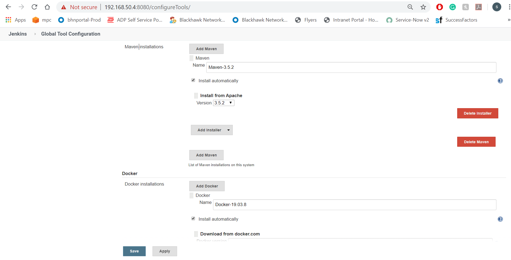

# CI-CD-Docker
CI-CD Process Using Docker, Jenkins SonarQube

Project to automatically manage the process of building, testing with the highest coverage, and deployment phases.

Our goal is to ensure our pipeline works well after each code being pushed. The processes we want to auto-manage:
* Code checkout
* Run tests
* Compile the code
* Run Sonarqube analysis on the code
* Create Docker image
* Push the image to Docker Hub
* Pull and run the image

# Setup the services
one of our goals is to obtain the sonarqube report of our project, we should be able to access sonarqube from the jenkins service. Docker compose is a best choice to run services working together. We configure our application services in a yaml file as below.

``docker-compose.yml``
```yml
version: '3.2'
services:
  sonarqube:
    build:
      context: sonarqube/
    ports:
      - 9000:9000
      - 9092:9092
    container_name: sonarqube
  jenkins:
    build:
      context: jenkins/
    privileged: true
    user: root
    ports:
      - 8080:8080
      - 50000:50000
    container_name: jenkins
    volumes:
      - /tmp/jenkins:/var/jenkins_home #tmp directory is designed to be wiped on system reboot.
      - /var/run/docker.sock:/var/run/docker.sock
    depends_on:
      - sonarqube
```

Paths of docker files of the containers are specified at context attribute in the docker-compose file. Content of these files as follows.

``sonarqube/Dockerfile``
```
FROM sonarqube:6.7-alpine
```

``jenkins/Dockerfile``
```
FROM jenkins:lts
```

# run the script run.sh to start docker containers:
```
docker ps -a

CONTAINER ID        IMAGE                                     COMMAND                  CREATED             STATUS              PORTS                                              NAMES
4872f0c2f577        sivakumarvunnam/jenkins-pipeline:latest   "java -jar /pipeline…"   3 hours ago         Up 3 hours          0.0.0.0:8090->8090/tcp                             jenkins-pipeline
2ba8dd91d251        ci-cd-docker_jenkins                      "/sbin/tini -- /usr/…"   6 hours ago         Up 6 hours          0.0.0.0:8080->8080/tcp, 0.0.0.0:50000->50000/tcp   jenkins
a444f3dddeb3        ci-cd-docker_sonarqube                    "./bin/run.sh"           6 hours ago         Up 6 hours          0.0.0.0:9000->9000/tcp, 0.0.0.0:9092->9092/tcp     sonarqube
```

## Jenkins configuration

We have configured Jenkins in the docker compose file to run on port 8080 therefore if we visit http://localhost:8080 we will be greeted with a screen like this.


We need the admin password to proceed to installation. It’s stored in the ``/var/jenkins_home/secrets/initialAdminPassword`` directory and also It’s written as output on the console when Jenkins starts.

```
jenkins      | *************************************************************
jenkins      |
jenkins      | Jenkins initial setup is required. An admin user has been created and a password generated.
jenkins      | Please use the following password to proceed to installation:
jenkins      |
jenkins      | 43962da2933980197e45638c79cecd4f
jenkins      |
jenkins      | This may also be found at: /var/jenkins_home/secrets/initialAdminPassword
jenkins      |
jenkins      | *************************************************************
```

To access the password from the container.

```
docker exec -it jenkins sh
/ $ cat /var/jenkins_home/secrets/initialAdminPassword
```

After entering the password, we will download recommended plugins and define an ``admin user``.

After clicking **Save and Finish** and **Start using Jenkins** buttons, we should be seeing the Jenkins homepage. One of the seven goals listed above is that we must have the ability to build an image in the Jenkins being dockerized. Take a look at the volume definitions of the Jenkins service in the compose file.
```
- /var/run/docker.sock:/var/run/docker.sock
```

The purpose is to communicate between the ``Docker Daemon`` and the ``Docker Client``(_we will install it on Jenkins_) over the socket. Like the docker client, we also need ``Maven`` to compile the application. For the installation of these tools, we need to perform the ``Maven`` and ``Docker Client`` configurations under _Manage Jenkins -> Global Tool Configuration_ menu.



We have added the ``Maven and Docker installers`` and have checked the ``Install automatically`` checkbox. These tools are installed by Jenkins when our script([Jenkins file](https://github.com/sivakumarvunnam/CI-CD-Docker/blob/master/Jenkinsfile)) first runs. We give ``Maven-3.5.2`` and ``Docker-19.03.8`` names to the tools. We will access these tools with this names in the script file.

Since we will perform some operations such as ``checkout codebase`` and ``pushing an image to Docker Hub``, we need to define the ``Docker Hub Credentials``. These definitions are performed under _Jenkins Home Page -> Credentials -> Global credentials (unrestricted) -> Add Credentials_ menu.


